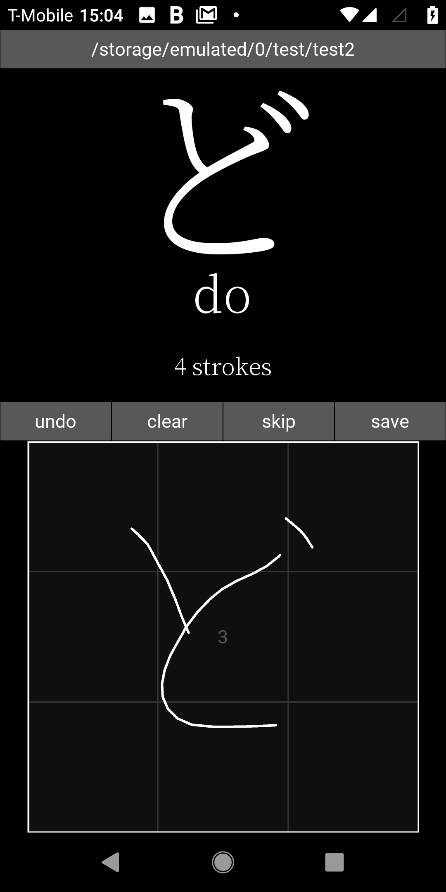

# ChouBenkyo
A simple app created in Kivy to collect observations for a project utilizing neural networks for Japanese written text recognition.

https://github.com/coreyryanhanson/japanese_text_classifiers
   

  

The basic structure of the app is partially inspired by the Android app, [Obenkyo](https://play.google.com/store/apps/details?id=com.Obenkyo). This repo here is essentially for the prototype that soley exists to collect observations for the machine learning models. The big changes will occur when this is rewritten in Java and will introduce multiple character sets while leveraging Tensorflow Lite.

For now, if you'd like to submit your writing data, please send the files to choubenkyosubmissions@gmail.com
